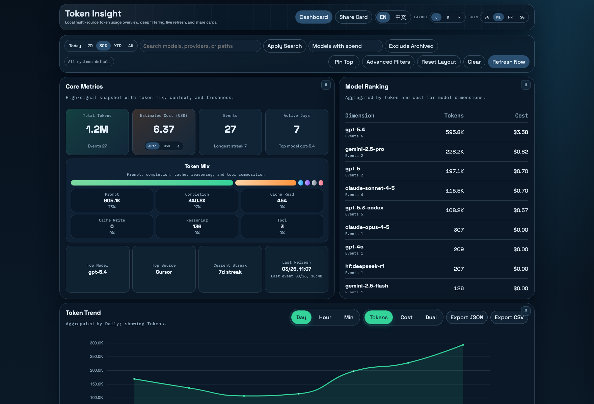
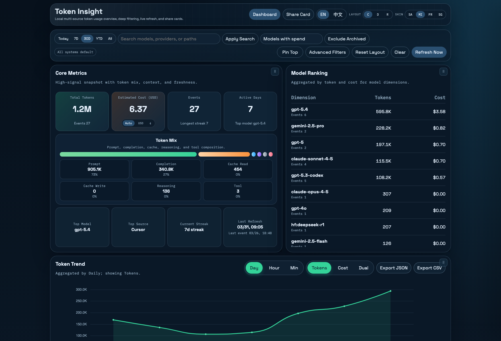
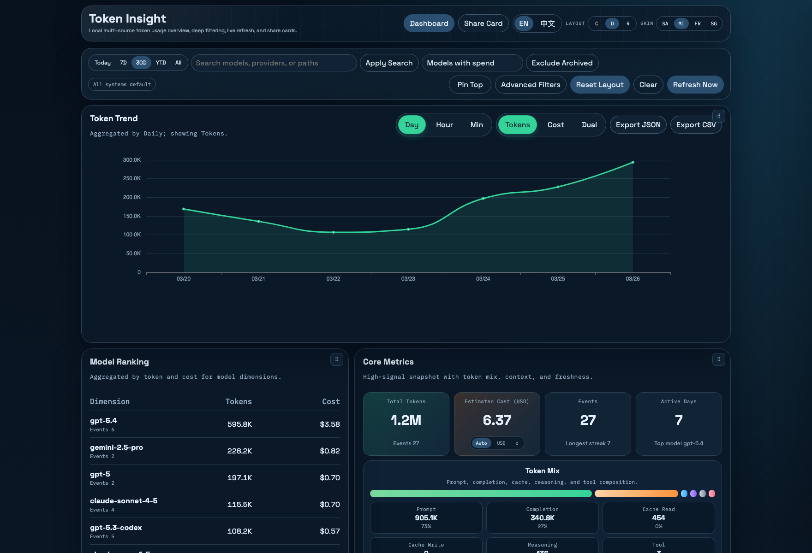
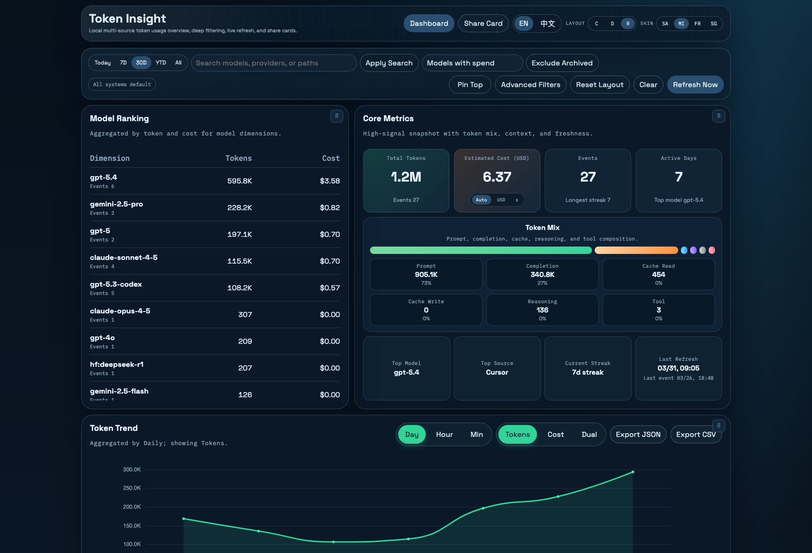

# Token Insight

[](https://hub.docker.com/r/mo2g/token-insight)
[](https://github.com/mo2g/token-insight)


[中文文档](./README.zh-CN.md)

Token Insight is a local-first token usage analytics stack for AI coding tools.  
It scans local artifacts, normalizes usage events, stores them in SQLite, and serves a polished dashboard with deep filtering, trend analysis, and social share cards.



## Why It Is Useful

- **Local-first by default**: no cloud login, no mandatory data upload.
- **Multi-source ingestion**: aggregates Codex, Claude, Gemini, Cursor, LiteLLM, and more from local artifacts.
- **Actionable dashboard**: trend charts, model/source breakdowns, contributions heatmap, and grouped source health status.
- **Dual-axis theme system**: switch both dashboard layouts (`console` / `dock` / `radar`) and color skins (`sand` / `midnight` / `frost` / `signal`).
- **Operational scripts included**: start dev/prod, refresh scans, export datasets, and generate PNG social cards.

## Repository Layout

- [`backend`](/Volumes/dev/web/mo2g/token-usage/backend): Rust CLI + HTTP API
- [`frontend`](/Volumes/dev/web/mo2g/token-usage/frontend): React + Vite dashboard
- [`scripts`](/Volumes/dev/web/mo2g/token-usage/scripts): dev/start/export/refresh/share helpers

## Quick Start

### Run with Docker Compose

```bash
docker compose up --build

docker run --rm -p 8787:8787 \
  -v $HOME:/host-home:ro \
  -e TOKEN_INSIGHT_HOME=/host-home \
  -e TOKEN_INSIGHT_SOURCE_ROOT_LITELLM=/host-home/.litellm \
  mo2g/token-insight:latest
```

Open `http://localhost:8787`.

The compose stack mounts your host home directory as read-only at `/host-home` and sets:

- `TOKEN_INSIGHT_HOME=/host-home`
- `TOKEN_INSIGHT_SOURCE_ROOT_LITELLM=/host-home/.litellm` (override when LiteLLM logs are elsewhere)

Container runtime uses `gcr.io/distroless/cc-debian12` to reduce image size while keeping required glibc runtime libraries.
Distroless images do not include a shell or package manager, so use logs and HTTP health endpoints for diagnostics.


### Requirements

- Rust stable toolchain (`cargo`)
- [Bun](https://bun.sh/) runtime

### Install and verify

```bash
bun --cwd frontend install
cargo test --manifest-path backend/Cargo.toml
bun --cwd frontend test
bun --cwd frontend build
```

### Run locally

```bash
./scripts/dev.sh
```

Open the frontend URL printed by Vite (default `http://localhost:5173`).  
Backend defaults to `http://127.0.0.1:8787`.

## Common Commands

```bash
# Production-like local startup
./scripts/start.sh

# Force a full rescan
./scripts/refresh.sh

# Export normalized events (CSV/JSON)
./scripts/export.sh --dataset events --format csv --output /tmp/token-events.csv

# Generate social image
./scripts/share-image.sh --preset summary --output /tmp/token-share.png

# Generate README layout screenshots
./scripts/capture-doc-screenshots.sh
```

## Layout Themes (Tech UI)

| Console | Dock | Radar |
| --- | --- | --- |
|  |  |  |

## Privacy and Data Behavior

- Source roots follow local tool conventions; missing paths are skipped automatically.
- The app runs locally by default and does not upload usage data.
- Cost estimation uses a built-in pricing snapshot and can refresh remote pricing when network is available.

## LiteLLM Ingestion

- Token Insight supports LiteLLM log ingestion via JSONL artifacts.
- Default LiteLLM root is `~/.litellm` (or `$TOKEN_INSIGHT_HOME/.litellm` inside containers).
- Override with `TOKEN_INSIGHT_SOURCE_ROOT_LITELLM`, and pass multiple roots with comma-separated paths.

## Contributing

See [CONTRIBUTING.md](./CONTRIBUTING.md) for setup, verification, and contribution scope.

## Roadmap

- Add more source adapters and richer parser fixtures.
- Add publish-ready social media visuals and demo GIFs.
- Add CI and release automation once API and UX stabilize.


## Alternatives

- [tokendashboard](https://github.com/pdajoy/tokendashboard)

## Credits

- [tokscale](https://github.com/junhoyeo/tokscale)
- [ccusage](https://github.com/ryoppippi/ccusage)
- [LiteLLM](https://github.com/BerriAI/litellm)
- [OpenRouter](https://openrouter.ai)
